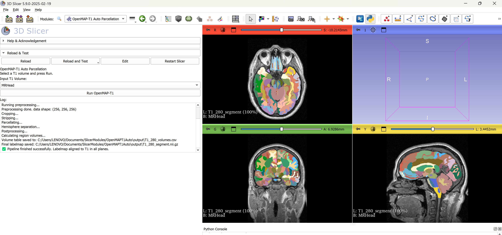

# OpenMAPT1Auto

**OpenMAPT1Auto** is a 3D Slicer module that automatically parcellates the human brain into **280 anatomical regions** from T1-weighted MRI scans and computes their volumes.

---

## Features

- Fully automated brain parcellation into 280 regions.
- Volume calculation for each labeled structure.
- Compatible with 3D Slicer (v5.x recommended).
- Outputs:
  - NIfTI segmented volume
  - CSV file with LabelID and Volume (mm³)
  - Optional color-coded label map visualization
  - Label lookup file for ITK-SNAP (`Untitled.txt`)

---

## Installation

1. Clone this repository:

```bash
git clone https://github.com/niyaziacer/OpenMAPT1Auto.git
Open 3D Slicer

Go to Edit → Application Settings → Modules

Add the module folder path (example for Windows)

Restart 3D Slicer

Usage
Load a T1-weighted MRI (NIfTI format)

Open the OpenMAPT1Auto module

Set:

Input folder

Output folder

Model folder

Click Run

Example Data
MRHead_1.nii.gz – Example T1 MRI

T1_280_segment.nii.gz – Example segmented brain

T1_280_volumes.csv – Example volume table

Untitled.txt – Label lookup for ITK-SNAP

Pretrained Models
Pretrained model weights cannot be distributed in this repository due to the JHU Research Software License.

Manual Download
Download from Google Drive:

OpenMAP-T1 Models

Place all model files (including penMAP-T1.pth) into your MODEL_FOLDER.

Automatic Download (Python)
python

import os
import gdown

model_folder = "MODEL_FOLDER"
os.makedirs(model_folder, exist_ok=True)

files = {
    "CNet.pth": "GDRIVE_FILE_ID_1",
    "HNet_axial.pth": "GDRIVE_FILE_ID_2",
    "HNet_coronal.pth": "GDRIVE_FILE_ID_3",
    "PNet_axial.pth": "GDRIVE_FILE_ID_4",
    "PNet_coronal.pth": "GDRIVE_FILE_ID_5",
    "PNet_sagittal.pth": "GDRIVE_FILE_ID_6",
    "SSNet.pth": "GDRIVE_FILE_ID_7",
    "penMAP-T1.pth": "GDRIVE_FILE_ID_8"
}

for fname, file_id in files.items():
    url = f"https://drive.google.com/uc?id={file_id}"
    out_path = os.path.join(model_folder, fname)
    if not os.path.exists(out_path):
        print(f"Downloading {fname}...")
        gdown.download(url, out_path, quiet=False)
    else:
        print(f"{fname} already exists, skipping.")
Install gdown:

bash
Kodu kopyala
pip install gdown
Parcellation Example
Below is an example of the parcellated brain output generated by the module:




References
OpenMAP-T1 Original Publication:

Nishimaki K, Onda K, Ikuta K, Chotiyanonta J, Uchida Y, Mori S, Iyatomi H, Oishi K; Alzheimer’s Disease Neuroimaging Initiative; Australian Imaging Biomarkers and Lifestyle Study of Ageing.
OpenMAP-T1: A Rapid Deep-Learning Approach to Parcellate 280 Anatomical Regions to Cover the Whole Brain.
Hum Brain Mapp. 2024 Nov;45(16):e70063.
doi: 10.1002/hbm.70063
PMID: 39523990 • PMCID: PMC11551626

License
This project is released under the MIT License.

Pretrained models follow the JHU Research Software License – No For-Profit, No Redistribution.
This software is intended for academic research only.


