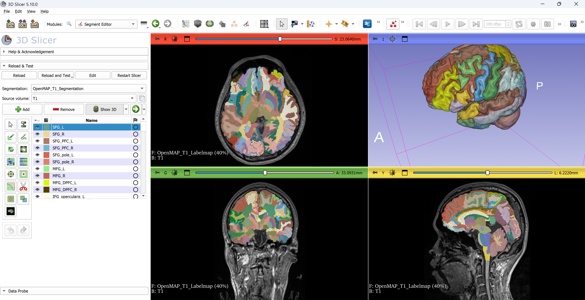

# OpenMAPT1Auto - 3D Slicer Extension

Automated brain MRI parcellation into **280 anatomical regions** using [OpenMAP-T1](https://github.com/OishiLab/OpenMAP-T1) deep learning model.



---

## ⚠️ License

| | |
|---|---|
| Extension code | MIT |
| OpenMAP-T1 models | JHU Research Software License — Non-Commercial |

> ✅ Non-commercial research use only  
> ❌ No commercial use without separate agreement  
> ✅ Attribution required in publications

---

## 🚀 Installation

### Prerequisites

- 3D Slicer Nightly (5.11 or later)
- NVIDIA GPU recommended (CPU also supported, slower)
- Internet connection for model download (~1.5 GB)

### Step 1 — Install from Extension Manager

1. Download and install 3D Slicer Nightly from https://download.slicer.org
2. Open Slicer → **View → Extension Manager**
3. Search for **OpenMAPT1Auto** → Install → Restart Slicer

### Step 2 — Download Models

1. Open **Modules → Segmentation → OpenMAP-T1 Auto Parcellation**
2. Click **Download Models from Google Drive**
3. Accept the license agreement
4. Wait for download (~1.5 GB, 10–15 minutes)

> **Manual download (if automatic fails):**  
> Download from [Google Drive](https://drive.google.com/file/d/1YEE65X5Cx8LHK-C070TbZARHp1C08KxA/view?usp=sharing), extract, and place `MODEL_FOLDER/` inside the extension's `qt-scripted-modules/` directory.

---

## 📖 Usage

1. Load your T1-weighted MRI: **File → Add Data**
2. Go to **Modules → Segmentation → OpenMAP-T1 Auto Parcellation**
3. Select your T1 volume from the dropdown
4. Click **Run OpenMAP-T1 Pipeline**
5. Wait for processing:
   - NVIDIA GPU: ~2–5 minutes
   - CPU only: ~15–45 minutes
6. Results appear automatically in 2D slices and 3D view

---

## 📂 Output Files

All outputs are saved in the `output/` folder inside the extension directory:

| File | Description |
|---|---|
| `T1_280_volumes.csv` | Volume measurements per region (CSV) |
| `T1_280_volumes.xlsx` | Volume measurements per region (Excel) |
| `T1_280_segment.nii.gz` | Segmentation labelmap (NIfTI) |

You can also export results to Excel directly using the **Export Results** button in the extension panel.

---

## 🔬 Features

- Automated brain parcellation into 280 anatomical regions
- Automatic dependency installation on first load
- Automatic model download from Google Drive (~1.5 GB)
- Non-commercial license agreement dialog
- Volume calculation for all regions
- Export results to CSV and Excel
- 3D visualization with labeled segments in Segment Editor
- Named segment labels from labeled.txt

---

## 🏗️ Pipeline Stages

| Stage | Description |
|---|---|
| Preprocessing | Standardize T1 volume |
| Cropping | Extract brain region |
| Skull stripping | Remove non-brain tissue |
| Parcellation | Segment into 280 regions |
| Hemisphere separation | Left/Right classification |
| Postprocessing | Align and refine segmentation |

---

## 🐛 Troubleshooting

| Problem | Solution |
|---|---|
| "Models not found" | Click **Download Models** button in the extension |
| Download fails | Use the manual download link above |
| Slow processing | Normal on CPU — wait 15–45 minutes. NVIDIA GPU recommended. |
| Alignment issues | Make sure you select the correct T1 volume from the dropdown |

---

## 🔬 Citation

If you use this extension in your research, please cite both:

**This extension:**
```bibtex
@software{openmapt1auto,
  title={OpenMAPT1Auto: 3D Slicer Extension for Automated Brain Parcellation},
  author={Acer, Niyazi},
  year={2025},
  url={https://github.com/niyaziacer/SlicerOpenMAPT1Auto}
}
```

**Original OpenMAP-T1 (required):**
```bibtex
@article{nishimaki2024openmap,
  title={OpenMAP-T1: A Rapid Deep Learning Approach to Parcellation of 280 Anatomical Regions to Cover the Whole Brain},
  author={Nishimaki, Taiki and others},
  year={2024}
}
```

---

## 🤝 Acknowledgments

Built upon [OpenMAP-T1](https://github.com/OishiLab/OpenMAP-T1) by Taiki Nishimaki and Johns Hopkins University.  
License: JHU Research Software License

---

## 📧 Contact

- Extension: acerniyazi@gmail.com
- OpenMAP-T1 models/license: [OishiLab GitHub](https://github.com/OishiLab/OpenMAP-T1)
